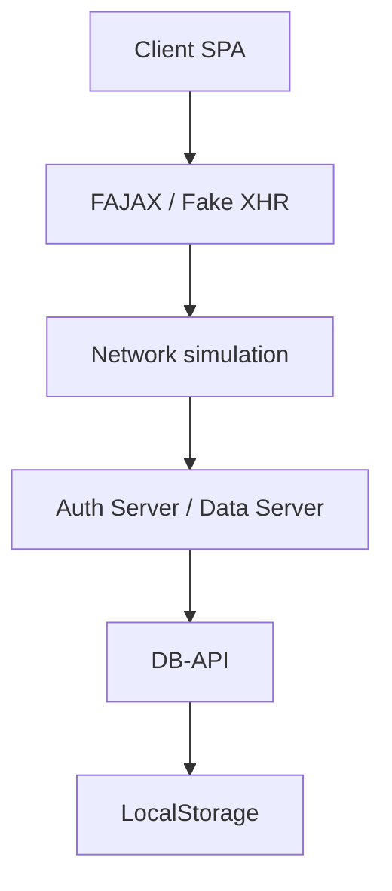
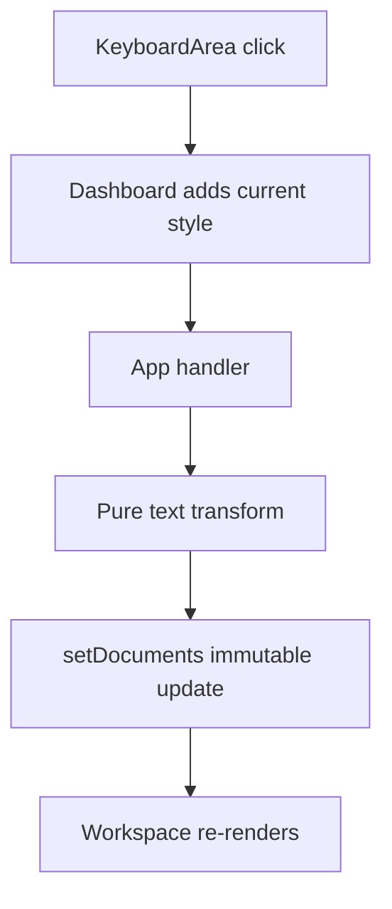
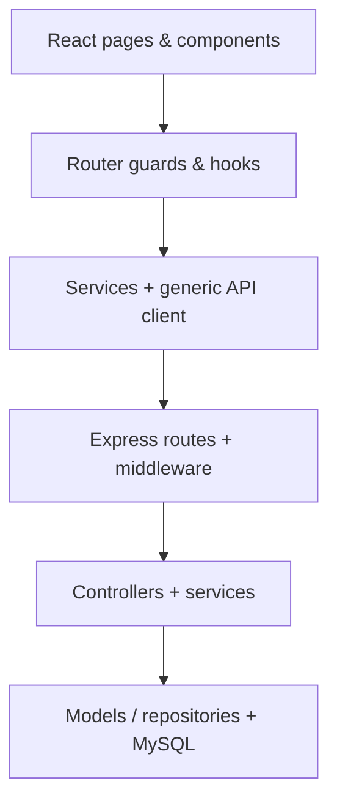

# Cumulative Roadmap for the Full-Stack Course Final Project

## Purpose of This Document

This document is intended to serve as working memory and an engineering specification for Codex or any other LLM that will assist in building the final project. It combines two types of sources:

1. The assignment instructions for Projects 1–7.
2. The implementations found on the default branch of the GitHub repositories.

The most important principle is that the course was built incrementally. Each project is not an isolated topic; it adds a new layer on top of the knowledge accumulated before it:

| Stage | What We Already Knew | What Was Added at This Stage |
|---|---|---|
| 1 | Web fundamentals | Semantic HTML, CSS, Responsive Design |
| 2 | HTML + CSS | JavaScript, DOM, events, state, and LocalStorage |
| 3 | HTML + CSS + JavaScript | OOP, SPA, simulated REST, Client/Server/Network/DB |
| 4 | All previous UI principles | Basic React: Components, Props, State, JSX |
| 5 | Basic React + REST concepts | Advanced React, Router, Hooks, Fetch, JSON Server |
| 6 | React + real REST from the client | Node.js, Express, MySQL, JWT, Middleware |
| 7 | All previous layers | A complete system with permissions, roles, media, and an organized architecture |

## Source Status and Verification Scope

The review was performed on July 27, 2026.

| Project | Repository | Default Branch | Verification Status |
|---|---|---|---|
| 1 | [Maoz-Daniel/fullstack-part1](https://github.com/Maoz-Daniel/fullstack-part1) | `main` | The instructions and code were reviewed |
| 2 | [Maoz-Daniel/fullstack-part2](https://github.com/Maoz-Daniel/fullstack-part2) | `main` | The instructions and code were reviewed |
| 3 | [Maoz-Daniel/fullstack-part3](https://github.com/Maoz-Daniel/fullstack-part3) | `main` | The instructions and code were reviewed |
| 4 | [Maoz-Daniel/fullstack-part4](https://github.com/Maoz-Daniel/fullstack-part4) | `main` | The instructions and code were reviewed; lint and the production build also passed |
| 5 | [Maoz-Daniel/fullstack-part5](https://github.com/Maoz-Daniel/fullstack-part5) | `main` | The instructions and code were reviewed |
| 6 | [Maoz-Daniel/fullstack-part6](https://github.com/Maoz-Daniel/fullstack-part6) | `main` | The instructions and code were reviewed |
| 7 | Not created yet | — | The requirements were analyzed for planning purposes |

When this document says “implemented,” it means the capability was found in the code. When it says “required,” it means the capability appeared in the instructions but was not necessarily verified in the implementation.

---
# Part A — Course Progression by Project

## Project 1 — HTML, CSS, and Responsive Web Design

### Goal of This Stage

Build a static, content-rich, multi-page, responsive website. At this stage there is still no business logic and no server. The focus is structure, presentation, navigation, and basic accessibility.

### What Was Learned

- HTML document structure.
- Semantic HTML: `header`, `nav`, `main`, `section`, `article`, `aside`, `footer`.
- Headings, paragraphs, lists, tables, and forms.
- Internal links between site pages and external links.
- Images, video, `iframe`, and `embed`.
- Shared CSS versus page-specific CSS.
- Box model, typography, colors, borders, and spacing.
- `display`, `position`, `Flexbox`, and `Grid`.
- `transition`, `animation`, pseudo-classes, and pseudo-elements.
- Responsive Design through Media Queries.
- Organizing assets into directories.

### What Was Actually Implemented

The project is an NBA website named HoopVerse with five main pages:

- `index.html` — home page.
- `pages/highlights.html`.
- `pages/teams.html`.
- `pages/players.html`.
- `pages/rules.html`.

Important implementation examples:

- [index.html](https://github.com/Maoz-Daniel/fullstack-part1/blob/main/index.html) uses `header`, `nav`, `main`, `section`, `article`, tables, images, and links.
- [teams.html](https://github.com/Maoz-Daniel/fullstack-part1/blob/main/pages/teams.html) uses video, a card grid, and an `iframe`.
- [rules.html](https://github.com/Maoz-Daniel/fullstack-part1/blob/main/pages/rules.html) uses an `aside`, lists, an embedded document, and content cards.
- [base.css](https://github.com/Maoz-Daniel/fullstack-part1/blob/main/css/shared/base.css) centralizes the reset, header, navigation, footer, and shared responsive behavior.
- [home.css](https://github.com/Maoz-Daniel/fullstack-part1/blob/main/css/home.css) combines Flexbox, Grid, hover effects, animation, and changing layouts.
- Separate CSS files define breakpoints for large screens, tablets, mobile devices, and narrow screens.

### Architecture at This Stage

```text
HTML pages
  ├─ shared CSS
  ├─ page-specific CSS
  └─ images / video / embedded content
```

There is no state, API, or persistence. Moving between “screens” means actually navigating between HTML files.

### What Must Carry Forward to the Final Project

- Use semantic HTML inside JSX as well.
- Maintain a consistent separation between shared layout styling and feature-specific styling.
- Provide at least two views: desktop and mobile.
- Use Flexbox and Grid deliberately instead of rigidly positioning every element.
- Give images `alt` text, forms labels, and use a correct heading hierarchy.
- Use media queries, a screen-adaptive menu, and components that do not break at narrow widths.

### What Should Not Be Copied As-Is

- Do not duplicate the header/footer on every React page; in the final project they should be shared Components/Layout.
- Do not use ordinary HTML links for internal SPA navigation when React Router manages the application.
- Dynamic content should not be repeatedly hard-coded in HTML; create Components and use `map` over data.

---

## Project 2 — JavaScript, DOM, and LocalStorage

### What Was Added Compared with Project 1

The static interface became an interactive application. Logic, state, users, events, timers, and browser-based data persistence were added.

### Concepts and Tools Learned

- Variables, arrays, objects, and functions.
- Callbacks and arrow functions.
- `Object.freeze`, `Set`, `map`, `filter`, `find`, `sort`.
- DOM selection using `getElementById`, `querySelector`, and `querySelectorAll`.
- Creating and modifying the DOM: `createElement`, `textContent`, `innerHTML`, `classList`.
- Events: `click`, `submit`, `input`, `keydown`, `DOMContentLoaded`, `pageshow`.
- `preventDefault`.
- `setTimeout` and `setInterval`.
- `Date`, timestamps, and session expiration.
- JSON: `JSON.stringify` and `JSON.parse`.
- `localStorage` for persistent data.
- `sessionStorage` for the active session.
- Form validation and error messages.
- Separating JavaScript files by responsibility.
- JSDoc documentation and short comments.

### What Was Actually Implemented

The project is a gaming portal named FunZone:

- Registration and login.
- User lockout after failed login attempts.
- A session with an expiration time.
- An Auth Guard for protected pages.
- A Snake game with difficulty levels, a loop, pause, collision detection, and scores.
- A Wordle game with a dynamic keyboard, guess checking, and animations.
- A leaderboard.
- A personal profile and per-user statistics.
- Dark Mode persisted in LocalStorage.

Key files:

- [storage.js](https://github.com/Maoz-Daniel/fullstack-part2/blob/main/js/storage.js) is the central persistence layer: users, sessions, scores, and per-user game data.
- [auth.js](https://github.com/Maoz-Daniel/fullstack-part2/blob/main/js/auth.js) handles login, registration, validation, password strength, failed attempts, and lockout.
- [auth-guard.js](https://github.com/Maoz-Daniel/fullstack-part2/blob/main/js/auth-guard.js) prevents a protected page from being displayed when there is no valid session.
- [snake.js](https://github.com/Maoz-Daniel/fullstack-part2/blob/main/js/snake.js) demonstrates game state, timers, events, and a movement algorithm.
- [wordle.js](https://github.com/Maoz-Daniel/fullstack-part2/blob/main/js/wordle.js) demonstrates arrays, state, dynamic DOM, keyboard events, and timeouts.
- [profile.js](https://github.com/Maoz-Daniel/fullstack-part2/blob/main/js/profile.js) centralizes statistics, username updates, and data reset.

### Identifiable Design Patterns

- Storage layer: one file provides an API for storage instead of every page accessing keys arbitrarily.
- Per-user namespacing: data keys are composed from a metric name and a user.
- Guard: check the session before displaying protected content.
- Configuration objects: constants and difficulty levels are stored in frozen objects.
- Separation of concerns: auth, storage, game logic, leaderboard, and profile are kept in separate files.

### What Must Carry Forward to the Final Project

- Client-side form validation for user experience.
- Explicit state for every screen: loading, success, empty, and error.
- Clear event handling.
- A central helper/service instead of scattered access to storage or the API.
- Store only minimal session information on the client.
- Document complex functions and avoid one enormous file.

### What Was a Temporary Educational Solution

- Users and passwords in LocalStorage are not real authentication.
- A client-side Auth Guard alone is not security.
- A lockout stored in the browser can be bypassed.
- In the final project, the server and database are the source of truth; the client does not decide by itself whether a user is authorized.

---

## Project 3 — Communication, OOP, and JavaScript

### What Was Added Compared with Project 2

Project 2 was a single browser application that accessed LocalStorage directly. Project 3 creates a complete architectural separation, even though all components still run in the browser:



### Central Concepts

- SPA without a framework.
- Client-side routing using URL hashes and HTML templates.
- ES Modules: `import` and `export`.
- OOP using `class`.
- `FXMLHttpRequest` as a simulation of `XMLHttpRequest`.
- Requests and responses in JSON format.
- REST resources and `GET`, `POST`, `PUT`, `DELETE` operations.
- Status codes: `200`, `201`, `400`, `401`, `403`, `404`, `405`, `500`.
- Asynchronous communication.
- Latency and packet loss.
- Timeout and communication-failure handling.
- Separation between an Auth Server and a Data Server.
- A simple token simulating token authentication.
- A DB-API that hides storage details from the server.
- Generic CRUD: insert, get, update, delete.
- Server-side ownership checks.
- A central state module on the client.
- Seed data.
- Bootstrap 5.3.3 was actually added for styling alongside custom CSS.

### What Was Actually Implemented

The application is a meeting-management system:

- Users can register and log in.
- Create, read, update, and delete meetings.
- Invite participants.
- Accept or reject invitations.
- View only meetings owned by the user or accepted invitations.

#### Client Layer

- [router.js](https://github.com/Maoz-Daniel/fullstack-part3/blob/main/js/client/router.js) maps hashes to a `template` and renders an SPA.
- [state.js](https://github.com/Maoz-Daniel/fullstack-part3/blob/main/js/client/state.js) centralizes the token, current user, meetings, and users.
- [app.js](https://github.com/Maoz-Daniel/fullstack-part3/blob/main/js/client/app.js) performs bootstrap and top-level orchestration.
- Separate files handle auth, meetings, invitations, participants, modal, panel, and toast behavior.

#### Communication Layer

- [fajax.js](https://github.com/Maoz-Daniel/fullstack-part3/blob/main/js/comm/fajax.js) defines `FXMLHttpRequest` with `open`, `setRequestHeader`, `send`, `readyState`, `status`, `responseText`, and `onreadystatechange`.
- A new request is created for each operation.
- A five-second timeout detects a dropped request.
- [network.js](https://github.com/Maoz-Daniel/fullstack-part3/blob/main/js/comm/network.js) adds a random delay of 1–3 seconds and 20% packet loss.
- The Network routes `/auth/...` to the Auth Server and `/api/...` to the Data Server.

#### Simulated Server Layer

- [auth-server.js](https://github.com/Maoz-Daniel/fullstack-part3/blob/main/js/server/auth-server.js) handles registration/login and issues a simulated token.
- [data-server.js](https://github.com/Maoz-Daniel/fullstack-part3/blob/main/js/server/data-server.js) parses the URL and method and routes to handlers.
- [session.js](https://github.com/Maoz-Daniel/fullstack-part3/blob/main/js/server/session.js) verifies the token and returns `401` when it is invalid.
- Separate handlers deal with meetings, invitations, and users.

#### Data Layer

- [db-api.js](https://github.com/Maoz-Daniel/fullstack-part3/blob/main/js/db/db-api.js) provides a generic CRUD API over LocalStorage collections.
- Only server code calls the DB-API.
- [seed.js](https://github.com/Maoz-Daniel/fullstack-part3/blob/main/js/db/seed.js) creates users, meetings, and invitations for demonstration purposes.

### The Important Architectural Achievement

The value of the project is not LocalStorage or Fake AJAX. Its value is the responsibility boundaries:

- The Client displays the interface and sends requests.
- The Network transfers requests.
- The Server authenticates, applies rules, and decides which operation is allowed.
- Only the DB layer touches the data.

This is the conceptual skeleton on which Projects 5–7 were built.

### What Must Carry Forward to the Final Project

- A request passes through a defined API and does not access the database directly.
- The server verifies authentication, authorization, ownership, and input validity.
- The data layer is hidden behind functions/modules.
- JSON is the transfer format.
- Timeouts, network errors, and status codes are handled.
- Consistent error messages must be returned.
- The auth concern and application concern remain separate even if they run in the same process.

### What Should Not Be Copied into the Final Project

- `FXMLHttpRequest`, random delay, and packet loss were an educational simulation. The final project uses real Fetch.
- A random token is not a JWT.
- LocalStorage is not a database.
- Authorization must not be performed only on the client.

---

## Project 4 — Basic React

### What Was Added Compared with Project 3

The important transition is from imperative DOM work to declarative UI:

- Before React: find an element and modify it manually.
- In React: state changes, and React renders the appropriate UI.

Project 3 focused on simulating communication and server layers. Project 4 returns to the client and replaces the template mechanism and manual DOM operations with a Component tree driven by state. The implementation does not use React Router or a server; those are added in Projects 5–6.

### Tools and Versions Found

In `package.json` and `package-lock.json`:

- React and React DOM `19.2.4`.
- Vite was declared as `^8.0.1` and locked to `8.0.3`.
- `@vitejs/plugin-react` version `6.0.1`.
- ESLint `9.39.4`, with JavaScript, React Hooks, and React Refresh rules.
- ES Modules and JSX.
- Web Storage API through `localStorage`.
- `crypto.randomUUID()` for stable document and text-character IDs.
- Separate CSS for each Component alongside global CSS.

Sources:

- [package.json](https://github.com/Maoz-Daniel/fullstack-part4/blob/main/package.json).
- [vite.config.js](https://github.com/Maoz-Daniel/fullstack-part4/blob/main/vite.config.js).
- [eslint.config.js](https://github.com/Maoz-Daniel/fullstack-part4/blob/main/eslint.config.js).
- [main.jsx](https://github.com/Maoz-Daniel/fullstack-part4/blob/main/src/main.jsx) renders `App` using `createRoot` inside `StrictMode`.

### Concepts Implemented

- JSX and Functional Components.
- Props for passing data and callbacks from parent to child.
- `useState` for application state and local UI state.
- Controlled inputs in login/registration, search, replacement, and filename forms.
- Event handlers and `preventDefault`.
- Conditional rendering: authentication screen versus editor, error messages, highlighting, and a disabled undo button.
- List rendering with `map` and `key`.
- Lifting state up: documents, active document, user, and search are held in `App` because several components consume them.
- Local state in the lowest component that needs it: keyboard language, current style and apply mode, find/replace values, and file selection.
- Immutable updates using spread, `map`, `filter`, `slice`, and functional state updaters.
- Composition of Components by feature.
- Separation of the UI from pure domain functions and storage adapters.
- Persistence in LocalStorage.
- A simple document state machine: new/open, active, dirty/saved, with history for undo.

### Actual Implementation Structure

```text
src/
  App.jsx                         orchestration + shared application state
  components/
    Auth/                         login/register UI
    TopBar/FileMenu/              new, save, save-as, open, logout
    Workspace/DisplayArea/        multiple documents + active document
    Dashboard/
      StylePanel/                 forward/all-text styling
      KeyboardArea/               Hebrew/English/symbols/emojis
      DeletePanel/                delete char/word/all
      AdvancedPanel/              search, replace, undo
  utils/
    auth/                         validation, users, current session
    editor/                       document lifecycle and pure text transforms
    files/                        names, per-user index and LocalStorage I/O
```

#### Orchestration and State Flow

- [App.jsx](https://github.com/Maoz-Daniel/fullstack-part4/blob/main/src/App.jsx) is the main container and holds `currentUser`, `documents`, `activeDocumentId`, `searchQuery`, and `fileList`.
- `App` computes the active document and passes state and callbacks for modifying it to `TopBar`, `Workspace`, and `Dashboard`.
- [Dashboard.jsx](https://github.com/Maoz-Daniel/fullstack-part4/blob/main/src/components/Dashboard/Dashboard.jsx) holds the current typing style and apply mode, and composes four panels.
- [Workspace.jsx](https://github.com/Maoz-Daniel/fullstack-part4/blob/main/src/components/Workspace/Workspace.jsx) renders a document list; clicking changes the active document.
- [DisplayArea.jsx](https://github.com/Maoz-Daniel/fullstack-part4/blob/main/src/components/Workspace/DisplayArea/DisplayArea.jsx) renders every character as its own styled `span` and highlights a character matching the search.

A typical event flow:



#### Document Model and Editing Operations

- [documentLifecycle.js](https://github.com/Maoz-Daniel/fullstack-part4/blob/main/src/utils/editor/documentLifecycle.js) creates a document with an `id`, `textElements` array, history, `fileName`, and `isDirty`.
- Each character is represented by its own object: identifier, character, color, font size, and font family. This allows every character to be displayed with a different style.
- `updateActiveDocument` accepts an updater function, stores the previous snapshot in history, and returns a new document array.
- [textTransforms.js](https://github.com/Maoz-Daniel/fullstack-part4/blob/main/src/utils/editor/textTransforms.js) contains pure functions for adding a character, deleting a character/word, clearing, styling all text, and replacing characters.
- Undo retrieves the last snapshot from the active document’s history.
- [workspaceUtils.js](https://github.com/Maoz-Daniel/fullstack-part4/blob/main/src/utils/editor/workspaceUtils.js) handles document creation, opening into the workspace, lookup by ID/name, and closing without leaving the workspace empty.

#### UI Components

- [KeyboardArea.jsx](https://github.com/Maoz-Daniel/fullstack-part4/blob/main/src/components/Dashboard/KeyboardArea/KeyboardArea.jsx) defines layouts for Hebrew, English, symbols, and emojis, and renders rows and keys from lists.
- [StylePanel.jsx](https://github.com/Maoz-Daniel/fullstack-part4/blob/main/src/components/Dashboard/StylePanel/StylePanel.jsx) controls font, size, and color in two modes: styling only new characters or all text.
- `DeletePanel` provides deletion of the last character, last word, or all text.
- `AdvancedPanel` composes `SearchBox`, `ReplaceBox`, and `UndoButton`.
- `FileMenu` provides New, Save, Save As, Open, active filename display, and Logout.

#### Local Authentication and Persistence

- [Auth.jsx](https://github.com/Maoz-Daniel/fullstack-part4/blob/main/src/components/Auth/Auth.jsx) is one controlled form that switches between login and registration.
- `authRules.js` separates validation and registration/login rules from the Component.
- Users and passwords, the active user, the file index, and file contents are stored in LocalStorage.
- The file index includes an `owner`, so the Open list is filtered by the active user.
- Save As validates the name, checks for existence, and asks for confirmation before overwriting.
- Closing a dirty document starts a flow that either saves it or confirms loss of changes.

### What the Implementation Teaches Architecturally

- React is not merely a replacement for `innerHTML`; it changes the source of truth to state and makes the UI a function of that state.
- Data flows down through props, and events flow up through callbacks.
- Shared state lives in `App`; local state remains in the relevant component.
- Editor and storage functions are outside the components, so components focus mainly on orchestration and presentation.
- Pure transformations simplify reasoning, testing, and reuse.
- A data model suited to the UI — here, an array of styled characters — enables direct rendering without DOM manipulation.
- The `components` and `utils` directory boundaries are an important intermediate step toward the `pages`, `hooks`, and `services` structure in Project 5.

### Cautionary Points Found in the Code

- This is educational authentication only: passwords are stored as plain text and authentication is performed in the browser.
- The file index is filtered by `owner`, but file content is stored under an `editor_file_<fileName>` key that does not include a user ID. Therefore, two users with the same filename can overwrite or open the same content. In the final project, ownership must be enforced by the server and DB.
- `JSON.parse` calls for LocalStorage are not wrapped with handling for corrupted data.
- There is no React Router, API, Fetch, or server; they must not be attributed to Project 4.
- There is no automated test framework. However, `npm run lint` and `npm run build` both passed during verification.
- Form/button components require additional accessibility work, such as explicit association between a `label` and input and an accessible name for the close button.

### Principles That Must Carry Forward to the Final Project

- Every page is composed of small components with clear responsibilities.
- State is kept at the lowest level that needs it, but lifted to a common parent when several children need it.
- Props are not mutated directly.
- Lists receive a stable `key`.
- Do not modify the DOM manually when the view can be expressed through state.
- Constant information, form information, and information received from the server are not the same kind of state.
- Separate general UI components from feature components.

### What Should Not Be Copied as a Final Solution

- “Files” and users in LocalStorage were a client-only exercise.
- In the final project, private user information is stored and protected on the server and in the DB.

---

## Project 5 — Advanced React and REST with JSON Server

### What Was Added Compared with Project 4

React evolved from a local application into an API client:

- Real navigation in an SPA.
- Pages and layouts.
- Protected routes.
- Forms.
- Fetch and async/await.
- A service layer.
- JSON Server.
- Pagination, caching, and progressive loading.

### Tools and Versions Found

In the `package.json` files:

- React `19.2.5`.
- React DOM `19.2.5`.
- React Router DOM `7.15.0`.
- Vite `8.0.10`.
- ESLint `10.2.1`.
- JSON Server `0.17.4`.

Sources:

- [client/package.json](https://github.com/Maoz-Daniel/fullstack-part5/blob/main/client/package.json).
- [server/package.json](https://github.com/Maoz-Daniel/fullstack-part5/blob/main/server/package.json).

### Client Architecture

```text
src/
  router/        route definitions, layouts, loaders, guards
  pages/         page/feature folders
  components/ui  shared UI
  hooks/         reusable stateful behavior
  services/      API access by resource
  services/core  generic HTTP, cache, pagination
  utils/         pure helpers and session utilities
```

### React Router

[router.js](https://github.com/Maoz-Daniel/fullstack-part5/blob/main/client/src/router/router.js) uses:

- `createBrowserRouter`.
- `RouterProvider`.
- Nested routes.
- `Outlet`.
- A root layout.
- A protected layout.
- Route loaders.
- An error element.
- Route params.
- Informative URLs:
  - `/home`
  - `/todos`
  - `/posts`
  - `/albums`
  - `/users/:userId/posts/:postId`
  - `/users/:userId/albums/:albumId/photos`

[loaders.js](https://github.com/Maoz-Daniel/fullstack-part5/blob/main/client/src/router/loaders.js) performs:

- Redirecting an unauthenticated user to `/login`.
- Redirecting an authenticated user away from login/registration.
- Loading data before render.
- Checking that the `userId` in the URL matches the active user.
- Parallel loading with `Promise.all`.

### Hooks

- `useState` for forms and UI state.
- `useLoaderData` for receiving data from the Router.
- `useNavigate` for navigation after an operation.
- A custom hook named [useLocalStorage.js](https://github.com/Maoz-Daniel/fullstack-part5/blob/main/client/src/hooks/useLocalStorage.js).
- A custom hook named [useAuth.js](https://github.com/Maoz-Daniel/fullstack-part5/blob/main/client/src/hooks/useAuth.js).
- A custom hook named [usePaginatedItems.js](https://github.com/Maoz-Daniel/fullstack-part5/blob/main/client/src/hooks/usePaginatedItems.js).

The code rarely needs `useEffect` for initial loading because React Router loaders perform it before render. This is a deliberate use of the Data Router architecture.

### Service Layer and Fetch

[apiClient.js](https://github.com/Maoz-Daniel/fullstack-part5/blob/main/client/src/services/core/apiClient.js) centralizes:

- Base URL.
- Method.
- JSON headers.
- Serialization.
- Checking `response.ok`.
- Parsing.
- Error propagation.
- The option to receive response headers.

Service files are separated by resource:

- `authService.js`.
- `todosService.js`.
- `postsService.js`.
- `albumsService.js`.

The implemented operations include `GET`, `POST`, `PATCH`, and `DELETE`. The instructions taught `PUT`; the actual implementation uses `PATCH` for partial updates in JSON Server. The final project must make a consistent choice:

- `PUT` when replacing a complete representation.
- `PATCH` when updating only some fields.

### Caching

[cacheStore.js](https://github.com/Maoz-Daniel/fullstack-part5/blob/main/client/src/services/core/cacheStore.js) uses an in-memory `Map`:

- `getCached`.
- `setCached`.
- `deleteCached`.
- Invalidation by key or prefix.

This saves duplicate requests while the application is open. It is not a persistent cache after refresh.

### Pagination and Progressive Loading

- Requests include `_page` and `_limit`.
- [pagination.js](https://github.com/Maoz-Daniel/fullstack-part5/blob/main/client/src/services/core/pagination.js) reads the `Link` header and extracts `rel="next"`.
- `usePaginatedItems` prevents duplicate requests while loading is already in progress.
- Todos, posts, comments, albums, and photos are loaded in batches.
- Images are not all loaded in advance.

### Forms and Validation

- Login and Registration are controlled forms.
- Registration is divided into two stages.
- Validation is kept in separate files.
- Loading/error messages are included in component state.
- Delete operations use `ConfirmDialog`.

### Data Management by Resource

- Todos: search, sort, create, edit, complete/uncomplete, delete.
- Posts: list/details, search, create, edit, delete.
- Comments: lazy/paginated loading, add, edit/delete by user.
- Albums: list/search/create/delete.
- Photos: progressive loading, create, edit/delete.

### Authentication at This Stage

The active user is stored in LocalStorage. `website` is used as the password and removed from the session object. Protected routes rely on the existence of the local object.

This is appropriate for JSON Server and the assignment, but it is not real security. JSON Server does not enforce ownership or authentication on the server.

### What Must Carry Forward to the Final Project

- React Router with layouts, nested routes, params, and error handling.
- Protected routes.
- Pages/components/features.
- A generic API client.
- One service per resource.
- Custom hooks for repeated behavior.
- Controlled forms and validation.
- Loading/error/empty states.
- Pagination or load more for large collections and media.
- Cache with invalidation after mutations.
- Informative URLs.

### What Is Replaced in the Final Project

- JSON Server is replaced with Express.
- `db.json` is replaced with MySQL.
- LocalStorage-only auth is replaced with JWT and server authentication.
- Ownership is not enforced only in a loader; the server must enforce it.

---

## Project 6 — Node.js, Express, MySQL, and JWT

### What Was Added Compared with Project 5

In Project 5, the client already communicated through REST, but the server was JSON Server. Project 6 builds a real backend:

- A Node.js process.
- Express routes.
- Middleware.
- Controllers.
- DB modules.
- A MySQL schema.
- JWT.
- Roles.
- Validation.
- An audit log.

### Dependencies Found

Server:

- Express `5.2.1`.
- CORS `2.8.6`.
- Joi `18.2.1`.
- jsonwebtoken `9.0.3`.
- mysql2 `3.22.5`.

Client:

- React `19.2.7`.
- React Router DOM `7.17.0`.
- Vite `7.2.6`.

Sources:

- [package.json](https://github.com/Maoz-Daniel/fullstack-part6/blob/main/package.json).
- [client/package.json](https://github.com/Maoz-Daniel/fullstack-part6/blob/main/client/package.json).

### Server Architecture

```text
server/
  index.js
  routes/
  controllers/
  middleware/
  validation/
  db/
  utils/
database/
  schema.sql
  grants.sql
  seed.sql
```

This architecture is close to MVC/layered architecture:

- Routes define endpoints and middleware.
- Controllers handle HTTP, validation, status codes, and rules.
- DB modules execute SQL.
- Middleware handles authentication, admin access, pagination, and errors.
- Validation schemas centralize input contracts.

There is no `services/` directory on the Project 6 server. In the final project, it is recommended to add one when there is significant business logic that is neither HTTP nor SQL.

### Express Bootstrap

[server/index.js](https://github.com/Maoz-Daniel/fullstack-part6/blob/main/server/index.js) includes:

- `express()`.
- `express.json()`.
- CORS for the Vite client.
- `exposedHeaders: ['Link']` so the client can read pagination information.
- Separate routes: users, todos, posts, comments, albums, photos, admin, and auth.
- 404 middleware.
- A central error handler.

### REST Routes

The routes implement:

- `/register`, `/login`.
- `/users`.
- `/todos`.
- `/posts`.
- `/comments`.
- `/albums`.
- `/photos`.
- `/admin/users`.
- `/admin/actions`.

The operations are `GET`, `POST`, `PUT`, and `DELETE`.

### Authentication and Authorization

[authenticateToken.js](https://github.com/Maoz-Daniel/fullstack-part6/blob/main/server/middleware/authenticateToken.js):

- Reads `Authorization: Bearer <token>`.
- Runs `jwt.verify`.
- Validates the payload.
- Reloads the active user from the DB.
- Rejects a token belonging to a blocked or deleted user.
- Attaches `req.activeUserId` and `req.activeUser`.

[requireAdmin.js](https://github.com/Maoz-Daniel/fullstack-part6/blob/main/server/middleware/requireAdmin.js) checks `is_admin`.

[createAuthToken.js](https://github.com/Maoz-Daniel/fullstack-part6/blob/main/server/utils/createAuthToken.js) signs a token with `id`, `username`, and an expiration time.

On the client:

- [apiClient.js](https://github.com/Maoz-Daniel/fullstack-part6/blob/main/client/src/services/apiClient.js) automatically attaches the Bearer token.
- [session.js](https://github.com/Maoz-Daniel/fullstack-part6/blob/main/client/src/utils/session.js) stores `{ user, token }` in LocalStorage.
- [ProtectedLayout.jsx](https://github.com/Maoz-Daniel/fullstack-part6/blob/main/client/src/router/ProtectedLayout.jsx) prevents navigation without a session and prevents a different username in the URL.
- Admin endpoints are protected on the server by two middleware functions: authentication and then role authorization.

### Ownership

In the controllers for todos, posts, comments, albums, and photos:

- The user ID for creation is derived from the token, not from the client.
- The record is loaded before update/delete.
- `existing.user_id` is compared with `req.activeUserId`.
- An attempt to modify another user’s resource returns `403` or a response that does not expose information.

This is a critical principle for Project 7: client guards provide UX; server guards provide security.

### Validation with Joi

The `server/validation` directory contains schemas by resource:

- Auth.
- Users.
- Todos.
- Posts.
- Comments.
- Albums.
- Photos.
- Admin filters.

The schemas define required/optional fields, types, min/max values, email, pagination defaults, and conversion of query-string values.

### MySQL and Data Access

[schema.sql](https://github.com/Maoz-Daniel/fullstack-part6/blob/main/database/schema.sql) defines:

- `users`.
- `users_passwords`.
- `todos`.
- `posts`.
- `comments`.
- `albums`.
- `photos`.
- `user_actions`.
- Primary keys.
- Unique constraints.
- Foreign keys.
- A one-to-one relationship between user and password.
- One-to-many relationships.
- `blocked_at` and `deleted_at`.

The `server/db/*.js` files:

- Use parameterized queries with `?`.
- Separate queries by resource.
- Filter soft-deleted records.
- Use `LIMIT` and `OFFSET`.
- Perform joins when related information is required.
- Wrap deletion of a post and its comments in a transaction using `START TRANSACTION`, `COMMIT`, and `ROLLBACK`.

### Soft Delete

Instead of immediately deleting rows:

- `deleted_at` receives a timestamp.
- Normal queries include `deleted_at IS NULL`.
- Deleting a post also marks its comments.
- Deleting an album also marks its photos in server code.

This enables audit/recovery, but requires every query to respect the filter.

### Passwords and DB Permissions

- Passwords are stored in a separate table.
- Password hash and salt are not returned to the client.
- Stored procedures verify/set passwords.
- `app_user` receives CRUD permissions on application tables but no direct permission for `users_passwords`.
- It receives only `EXECUTE` on credential-related stored procedures.

This demonstrates least privilege. However, for a new project, if the instructor permits it, bcrypt or Argon2 is preferable to direct SHA-256 with a salt.

### Audit Log and Admin

`user_actions` stores:

- Actor.
- Target.
- Action type.
- Resource type/ID.
- Details.
- Timestamp.

An Admin can:

- View users.
- Block and unblock users.
- Promote a user to admin.
- View the action log with filters and pagination.

### Pagination

[pagination.js](https://github.com/Maoz-Daniel/fullstack-part6/blob/main/server/middleware/pagination.js):

- Fetches `limit + 1` rows to detect another page.
- Returns a `Link` header with `rel="next"`.
- The client reads the header through CORS.

### Client Architecture

The client is also divided into:

- Router.
- Pages.
- Components.
- Hooks.
- Services.
- Utils.

Routes:

- `/login`.
- `/register`.
- `/users/:username/posts`.
- `/users/:username/todos`.
- `/users/:username/albums`.
- `/users/:username/albums/:albumId/photos`.
- `/users/:username/admin`.

### Important Gaps to Fix in the Final Project

These do not negate the value of Project 6; they define what should be improved:

1. `server/config.js` is required by the code but excluded by `.gitignore`, and the repository contains no `config.example.js` or `.env.example`. The final project must provide a template without secrets.
2. Base URLs and the CORS origin are hard-coded as localhost. In the final project, move them to environment variables.
3. There is no active test suite.
4. The Admin route on the client is not wrapped in a separate role guard; the server does block it. In the final project, protect the route for UX and protect it on the server for security.
5. Some GET endpoints for todos/posts/comments are publicly readable. If the final project’s data is private, apply authentication and ownership to reads as well.
6. A JWT in LocalStorage matches the course path, but consider an HttpOnly secure cookie if the assignment permits it.
7. There is still no file upload; this is a new Project 7 requirement.

### What Must Carry Forward to the Final Project

- Node.js + Express.
- Router modules.
- A Middleware pipeline.
- Controllers.
- A Service/business layer where needed.
- A DB/model layer.
- A MySQL schema with constraints and relationships.
- Parameterized SQL.
- JWT.
- Authentication + role authorization + ownership.
- Joi validation.
- Central error handling.
- CORS configuration.
- Pagination.
- Audit/logging as needed.
- Postman/API testing.

---

# Part B — Cumulative Concept Map

| Domain | Concepts and Tools | Introduced | Use in the Final Project |
|---|---|---|---|
| HTML | semantic tags, forms, tables, media, accessibility | 1 | Semantic JSX, accessible forms, and media |
| CSS | Flexbox, Grid, media queries, transitions | 1 | Desktop/mobile layouts |
| JavaScript | objects, arrays, functions, events, timers, Date | 2 | Client/server logic |
| DOM | selectors, creation, classes, events | 2 | Understanding UI; do not modify the DOM manually in React |
| Browser Persistence | LocalStorage, SessionStorage, JSON | 2 | Session/preferences only, not a DB |
| Basic Auth | login/register, expiry, guards, lockout | 2 | Basic UX that is replaced by server authentication |
| SPA | templates, client-side routing, state | 3 | React Router |
| OOP and Modules | classes, modules, imports/exports | 3 | Organization and separation of responsibilities |
| REST | resources, URL, GET/POST/PUT/DELETE | 3 | A real, documented API |
| Communication | request/response, JSON, async, timeout | 3 | Fetch and HTTP |
| Layering | Client/Network/Server/DB, DB-API | 3 | React/API/Express/MySQL |
| Basic React | JSX, Components, Props, State, Lists | 4 | Foundation of the entire client |
| Advanced React | Router, loaders, hooks, forms | 5 | Routing and stateful behavior |
| HTTP Client | Fetch, async/await, apiClient | 5 | A unified access layer |
| Fake Server | JSON Server, db.json | 5 | Prototype only |
| Performance | cache, invalidation, pagination | 5 | Collections and media |
| Backend | Node.js, Express, CORS | 6 | The project server |
| Validation | Joi | 6 | body/query/params |
| Database | MySQL, schema, constraints, joins | 6 | Source of truth |
| Security | JWT, Bearer, roles, ownership | 6 | Mandatory |
| Architecture | routes/controllers/db/middleware | 6 | MVC/layered architecture |
| Operations | soft delete, transactions, audit | 6 | According to the system type |
| Capstone | uploads, 2 roles, protected routes | 7 | Core requirements |

## Tool Inventory: Found, Required, and Not Found

| Tool/Technology | Status | Where and Why |
|---|---|---|
| Visual Studio Code | Required in the instructions | Development environment in the first projects |
| Git/GitHub | Required and present in the repositories | Version control and pair work |
| HTML5 | Implemented | Projects 1–3; structure and templates |
| CSS3 | Implemented | All user interfaces |
| Flexbox/Grid/Media Queries | Implemented | Project 1 onward |
| Vanilla JavaScript | Implemented | Projects 2–3 |
| LocalStorage/SessionStorage | Implemented | Educational persistence/session in Projects 2–5 |
| ES Modules | Implemented | Project 3 and later through Vite |
| Bootstrap 5.3.3 | Implemented | Project 3 only |
| React | Implemented | Projects 4–6; declarative client |
| React Router DOM | Implemented | Projects 5–6 |
| Vite | Implemented | Build/dev server in Projects 4–6 |
| ESLint | Configured | Client linting in Projects 4–5 |
| Fetch | Implemented | Projects 5–6 |
| Axios | Not found | Do not add it without need and justification |
| Redux | Not found | Do not add it if local state/hooks are sufficient |
| JSON Server | Implemented | Fake REST server in Project 5 |
| Node.js | Implemented | Server runtime in Project 6 |
| Express 5 | Implemented | REST server in Project 6 |
| CORS | Implemented | Connecting the client to Express in Project 6 |
| Joi | Implemented | Server validation in Project 6 |
| jsonwebtoken | Implemented | JWT in Project 6 |
| MySQL | Implemented | DB in Project 6 |
| mysql2 | Implemented | Node’s MySQL driver |
| ORM | Not found | The course uses direct SQL and DB modules |
| Postman | Required in the instructions | Testing endpoints in Project 6 and onward |
| MongoDB | Optional in Project 7 | Not implemented in the reviewed repositories |
| Multer/file upload library | Conceptually required in Project 7 | Not yet implemented; an upload mechanism must be selected |
| WebSockets/real-time | Optional in Project 7 | Not implemented in Projects 1–6 |
| TypeScript | Not found | The existing code is JavaScript |
| Automated test framework | Not found | Must be added to the final project |

## Code and Comment Conventions Learned from the Implementations

- Separate files by responsibility and domain.
- Use a shared file for shared styling/logic and feature-specific files for a feature.
- Keep resource names consistent across URL, service, controller, and DB module.
- Use constants instead of repeated magic strings.
- Use JSDoc or a short comment for functions and mechanisms that are not self-explanatory.
- Comments should explain “why” or a contract; there is no need to describe every obvious line.
- Keep validation helpers/schemas separate from the UI and SQL.
- Use a central API client instead of a different `fetch` in every page.
- Use a central error handler instead of duplicating `500` responses.
- Prefer small functions that return a clear value over one handler that does everything.
- Async functions should propagate an error or convert it into a consistent response; do not silently swallow errors.
- Generate IDs on the server/DB, not on the client.
- Sensitive data must not be included in responses or audit details.

---

# Part C — Target Architecture for Project 7

## Overall Picture



## Recommended Directory Structure

```text
project-root/
  client/
    src/
      app/
        router.jsx
        providers/
      layouts/
      pages/
      features/
        auth/
        users/
        <domain-feature>/
      components/
        ui/
      hooks/
      services/
        apiClient.js
      utils/
      styles/
    public/
    package.json
    .env.example

  server/
    index.js
    app.js
    config/
    routes/
    controllers/
    services/
    db/                # models/repositories and SQL
    middleware/
    validation/
    utils/
    uploads/           # if media is stored locally
    tests/

  database/
    schema.sql
    seed.sql
    grants.sql

  README.md
  .gitignore
  .env.example
```

Directory names may change, but the boundaries should not disappear.

## Mandatory Server-Side Layers

The final project’s server must contain clear, separate layers:

- `routes` — defines only the method, path, and middleware chain.
- `middleware` — authentication, authorization, validation, uploads, logging, and error handling.
- `controllers` — translates the HTTP request/response into the appropriate service call.
- `services` — an independent layer for business rules, ownership, orchestration of several operations, and transactions.
- `db` — data-access only: SQL, queries, connections, and row mapping.
- `validation` — Joi schemas and input contracts.
- `utils` — general helpers that do not belong to HTTP or SQL.

Correct request flow:

```text
Route → Middleware → Controller → Service → DB → MySQL
```

In Project 6, some logic that belongs to a service is located inside controllers or other layers. In the final project, move it into `services/` as an independent layer. A Controller must not execute SQL or contain most of the business logic; the DB layer must not decide permissions or build HTTP responses.

## Responsibility of Each Layer

### React Pages

- Connect routes, data, and feature components.
- Do not contain SQL or low-level HTTP details.
- Display loading/error/empty/success.

### React Components

- Receive props.
- Are responsible for a small UI unit.
- Shared UI does not know a business resource unless necessary.

### Hooks

- Centralize repeated stateful behavior.
- Examples: `useAuth`, `usePagination`, `useDebounce`, `useUpload`.

### Services/API Client

- Base URL.
- JSON/FormData.
- Token/cookie credentials.
- Parsing.
- Errors.
- API functions by resource.

### Express Routes

- Define method + path.
- Connect middleware and controller.
- Do not contain SQL.

### Middleware

- Authentication.
- Role authorization.
- Validation.
- Upload parsing.
- Rate limiting if required.
- Request logging.
- Centralized error handling.

### Controllers

- Translate HTTP input into a service call.
- Return a status code and JSON.
- Should not contain queries.
- Do not contain most business rules; those belong in Services.

### Services

- Business rules.
- Coordination between multiple models.
- Transactions.
- Ownership/permission policy when it is complex.
- An independent layer, separate from controllers, routes, and DB.

### DB / Models / Repositories

- SQL only, or data-access logic.
- Parameterized queries.
- Mapping rows to objects.

### MySQL

- Primary keys.
- Foreign keys.
- Unique constraints.
- Indexes on foreign keys and search fields.
- Timestamps.
- Status/deleted fields as needed.

---

# Part D — Authentication and Authorization Contract

## At Least Two User Types

For example:

- `user/customer/member`.
- `admin/manager`.

It is recommended to represent the role explicitly:

```text
users.role = 'user' | 'admin'
```

Alternatively, use a roles table if there are many roles and permissions.

## Login Flow

1. The client sends credentials to `POST /auth/login`.
2. The server performs Joi validation.
3. The server finds the user and verifies the password hash.
4. The server checks that the user is active and not blocked.
5. The server issues a JWT containing `sub/id`, role, and expiration.
6. The client stores the session according to the selected mechanism.
7. The API client attaches credentials to every request.
8. Middleware validates the token on every protected endpoint.
9. Additional middleware checks the role.
10. The service/controller checks ownership of the record.

## Password Storage Policy

- Passwords remain on the server and are never returned to the client — not during login, registration, `GET /users`, in a JWT, or in an audit log.
- Professionally, a password is not stored using reversible “encryption.” Store only a strong password hash with a salt, for example with bcrypt or Argon2.
- During registration, the server creates the hash and stores it in a field/table that is not exposed to the client.
- During login, the server compares the received password with the stored hash; it does not decrypt a password.
- A user response includes only safe, necessary fields such as `id`, `username`, `role`, and permitted profile details.
- Never write passwords, hashes, or salts to logs, errors, or debug output.

## Three Different Protection Layers

- A Route guard in React: prevents an unsuitable screen and improves UX.
- A Role guard in React: hides and prevents navigation to admin screens.
- Server Middleware/ownership: the real protection that cannot be bypassed through a URL or Postman.

Never derive the `userId` for a mutation only from a body sent by the client. Derive it from the JWT.

## Protection Against Changing an Identifier in the URL

- Manually changing `/users/5` to `/users/6` must not let user 5 read or modify user 6’s information.
- For every endpoint containing `:userId`, `:id`, or a resource identifier, the server loads the resource and checks ownership or role against the user authenticated by the JWT.
- A client-side route guard is UX only; a direct request through Postman must also be blocked by the server.
- When an operation refers to the active user, prefer an endpoint such as `/users/me` and derive identity from the token instead of accepting a user ID from the client.
- When access is forbidden, return `403`, or `404` according to a consistent policy that avoids exposing the existence of private information.
- Do not rely on random IDs or hiding a link as a security measure.

---

# Part E — REST API Design

## Naming Rules

- Use plural resource names: `/users`, `/products`, `/orders`.
- Put the identifier in the path: `/orders/:id`.
- Use a nested relationship when meaningful: `/albums/:albumId/photos`.
- Put filters in the query string: `?status=open&page=2&limit=20`.
- Use JSON for requests/responses except for uploads.

## Data Minimization and Incremental Loading

- Never return an entire collection if it can grow. Every list endpoint uses pagination with a default `limit` and a maximum limit enforced by the server.
- The client displays pages or `Load More`/infinite scroll and requests only the next portion when needed.
- Every endpoint returns only the fields required by the screen; do not perform `SELECT *` and send internal or sensitive fields to the client.
- Related data is loaded lazily: for example, comments or photos are loaded only when the user opens the relevant post or album.
- Prefer focused endpoints and server-side filters instead of downloading large amounts of data and filtering in the browser.
- Prevent duplicate requests using cache, request deduplication, and loading state; after a mutation, perform invalidation or an explicit cache update.
- Load in parallel only the information genuinely required by the current screen. The goal is both to avoid returning all data and to make as few server calls as possible.
- A list response should include metadata for loading the next part, such as `page`, `limit`, `hasMore`, or a `Link` header.

## Meaning of Methods

- `GET` — read without changing state.
- `POST` — create a resource or perform a non-idempotent operation.
- `PUT` — complete replacement, or an idempotent operation defined that way by the course.
- `PATCH` — partial update.
- `DELETE` — hard delete or soft delete with documented semantics.

## Recommended Status Codes

- `200 OK`.
- `201 Created`.
- `204 No Content`.
- `400 Bad Request`.
- `401 Unauthorized` — there is no valid authentication.
- `403 Forbidden` — the user is identified but is not authorized.
- `404 Not Found`.
- `409 Conflict`.
- `413 Payload Too Large` for a large upload.
- `422 Unprocessable Content` if semantic validation is handled separately.
- `500 Internal Server Error`.

## Consistent Error Responses

```json
{
  "error": {
    "code": "VALIDATION_ERROR",
    "message": "Invalid request data",
    "details": []
  }
}
```

Do not return a stack trace or SQL error to the client.

## Clear User-Facing Error Messages

- Every expected error has a stable `code` and a safe, clear message that the client can display.
- The client displays the message in the appropriate place: next to an invalid field, in a toast/dialog for an operation, or on an error screen with a retry option when loading fails.
- Distinguish between validation, the need to log in again, lack of permission, a missing resource, a conflict, a network problem, and a server error.
- A user-facing message explains what happened and what can be done, but does not expose stack traces, SQL, paths, tokens, or system details.
- Full technical details are written only to server logs, preferably with a request ID that can be linked to a general client message.
- Do not silently swallow an error, leave a spinner running forever, or display only `Something went wrong` when a safer and more precise explanation is available.

---

# Part F — Media Upload

This is a new requirement in Project 7 and is not implemented in the previous projects.

## Required Flow

1. A React form uses `input type="file"`.
2. The client creates `FormData`.
3. Do not manually set `Content-Type`; the browser adds the boundary.
4. Express middleware such as Multer reads the multipart data.
5. The server checks:
   - MIME type.
   - Extension, if relevant.
   - Size.
   - Number of files.
   - Permission to upload to the specific relationship/resource.
6. The file is saved in the selected storage.
7. Metadata/path/URL is stored in the DB, not necessarily the bytes.
8. The server returns the new resource.
9. The client updates cache/state.

Do not let the user choose an arbitrary server path, and generate safe, unique filenames.

---

# Part G — Roadmap for Building the Final Project

## Stage 0 — Select the Domain and Use Cases

- Define the two user types.
- Define 3–5 central resources.
- Define what each role can read and modify.
- Define ownership.
- Define what media is uploaded.
- Define at least one business workflow that is not flat CRUD.

Deliverable: a short document listing actors, use cases, and permissions.

## Stage 1 — ERD and MySQL

- Tables.
- PK/FK.
- Cardinalities.
- Unique constraints.
- Indexes.
- Delete policy.
- Seed.
- A DB user with limited permissions.

Deliverable: `schema.sql`, `seed.sql`, ERD.

## Stage 2 — Server Skeleton

- Express app.
- `express.json`.
- CORS.
- Routes.
- 404.
- Error handler.
- Configuration through environment variables.
- Health endpoint.

Deliverable: a server that starts and returns a basic response.

## Stage 3 — Authentication

- Register.
- Login.
- Password hashing.
- JWT.
- Authenticate middleware.
- Current-user endpoint.
- Logout/session policy.
- Blocked/deleted user behavior.

Deliverable: a Postman collection proving login and a protected request.

## Stage 4 — Roles and Permissions

- Role middleware.
- Ownership checks.
- Admin endpoints.
- Client role guard.
- Tests for forbidden access attempts.

## Stage 5 — Backend Resources

For every resource:

- Joi schemas.
- Routes.
- Controller.
- Service.
- Model/repository.
- GET list/detail.
- POST.
- PUT/PATCH.
- DELETE/soft delete.
- Filters.
- Pagination.

## Stage 6 — React Foundation

- Vite.
- Router.
- Layouts.
- Auth provider/hook.
- Protected routes.
- Role-protected routes.
- Generic API client.
- Global styles/theme.
- Responsive shell.

## Stage 7 — Feature Pages

For every feature:

- Page.
- Components.
- Service.
- Forms.
- Validation.
- Loading/error/empty.
- Consistent optimistic or pessimistic updates.
- Cache invalidation.

## Stage 8 — Uploads

- Client FormData.
- Server upload middleware.
- DB metadata.
- Permissions.
- Preview/progress if required.
- Cleanup when a resource is deleted.

## Stage 9 — Quality

- Postman/API tests.
- Unit tests for logic.
- Integration tests for auth/permissions.
- Responsive testing.
- Empty/loading/error testing.
- Lint.
- Accessibility pass.
- Security review.

## Stage 10 — Delivery

- README.
- Setup instructions.
- `.env.example`.
- DB migration/setup.
- Demo accounts without real secrets.
- Screenshots.
- API endpoint table.
- Architecture explanation.
- Known limitations.

---

# Part H — Project 7 Checklist

## UI and Responsive Design

- [ ] Complete and user-friendly interface.
- [ ] Desktop layout.
- [ ] Mobile layout.
- [ ] Flexbox/Grid.
- [ ] Semantic JSX.
- [ ] Forms with labels.
- [ ] Loading/error/empty/success.
- [ ] Media displayed responsively.

## React

- [ ] Organized pages and components.
- [ ] Shared layout.
- [ ] React Router.
- [ ] Nested routes where needed.
- [ ] Informative route params.
- [ ] Auth-protected routes.
- [ ] Role-protected routes.
- [ ] Custom hooks for repeated behavior.
- [ ] Controlled forms.
- [ ] Service layer.
- [ ] Pagination/load more.
- [ ] Cache + invalidation.
- [ ] Clear, safe validation and error messages placed near the failed action.

## Communication

- [ ] Generic API client.
- [ ] Fetch with async/await.
- [ ] JSON handling.
- [ ] Bearer/cookie credentials.
- [ ] Consistent REST paths.
- [ ] Status code handling.
- [ ] Timeout/network error UI.
- [ ] No component accesses the DB directly.
- [ ] Every list endpoint is loaded in portions; no complete collection download.
- [ ] Only resources and fields required by the current screen are loaded.
- [ ] Duplicate requests are prevented through cache/deduplication.

## Node/Express

- [ ] Modular Express app.
- [ ] Routes.
- [ ] Controllers.
- [ ] Services as an independent, separate layer.
- [ ] DB/models/repositories as a data-access-only layer.
- [ ] Middleware.
- [ ] Joi validation.
- [ ] Central error handler.
- [ ] CORS through configuration.
- [ ] Media upload.

## Users and Security

- [ ] At least two user types.
- [ ] Register/login.
- [ ] Strong password hashing with a salt.
- [ ] Password/hash/salt remain on the server and are never returned to the client.
- [ ] JWT with expiration.
- [ ] Authentication middleware.
- [ ] Role middleware.
- [ ] Ownership checks.
- [ ] User ID for a mutation is derived from the token.
- [ ] Changing an ID in the URL cannot read or modify another user’s resource.
- [ ] Blocked/deleted account policy.
- [ ] Secrets are not committed.
- [ ] `.env.example`.

## Database

- [ ] MySQL.
- [ ] ERD.
- [ ] PK/FK.
- [ ] Unique constraints.
- [ ] Indexes.
- [ ] Parameterized queries.
- [ ] Transactions for multi-step operations.
- [ ] Defined soft/hard delete behavior.
- [ ] Seed.
- [ ] A least-privilege DB user.

## Tools and Verification

- [ ] Git and GitHub.
- [ ] Commits by feature.
- [ ] Postman collection.
- [ ] ESLint.
- [ ] Test suite.
- [ ] README setup.
- [ ] Client/server/DB instructions.

---

# Part I — Direct Working Instructions for an LLM/Codex

The following section can be given to the model at the beginning of the work:

## Working Contract

You are assisting with the development of a final project for a Full-Stack course that was built incrementally.

1. Preserve the architecture learned in the course: React Client → API Client → Express Routes/Middleware → Controllers/Services → Models/Repositories → MySQL.
2. Do not skip layers by placing SQL inside a route or scattering Fetch calls across every component.
3. Use React Router with routes protected by authentication and role.
4. Every permission must be enforced on the server even if it is also enforced on the client.
5. Never trust a client-supplied `userId` for ownership; derive the active user from the JWT.
6. Use Joi for body/query/params.
7. Use parameterized SQL and transactions when an operation modifies several tables.
8. Return consistent JSON and status codes.
9. Use client-side service modules and a generic API client.
10. Create small Components, Hooks for repeated behavior, and Pages that connect them.
11. Add filtering, pagination, or load more for every large collection.
12. After a mutation, perform cache invalidation or an explicit state update.
13. Build desktop and mobile layouts using Grid/Flexbox and media queries.
14. For file uploads, validate type, size, count, and permission on the server.
15. Do not store secrets in code. Create `.env.example`.
16. Write tests for auth, roles, ownership, and central operations.
17. Before implementing a feature, state which ideas from Projects 1–6 it implements.
18. After implementing a feature, update the checklist and document endpoints and files.
19. Store passwords only as a strong salted hash on the server; never return a password, hash, or salt to the client.
20. Never return an entire collection: enforce pagination and a maximum limit on the server and use Load More or paging on the client.
21. Read only the resources and fields required by the current screen; use lazy loading, filters, cache, and request deduplication.
22. On every route containing an identifier, enforce ownership/role on the server against the JWT identity; changing an ID in the URL must never grant access.
23. Keep separate server-side layers for `controllers`, `db`, `middleware`, `routes`, `utils`, `validation`, and `services`; do not leave service logic inside a controller.
24. Return structured errors and show the user a clear, safe message with a possible action, without exposing internal details.

## Course-Fidelity Rules

- FAJAX and the LocalStorage database from Project 3 are conceptual models only; do not implement them in Project 7.
- LocalStorage-only authentication from Projects 2–5 is insufficient.
- JSON Server from Project 5 is replaced with Express + MySQL.
- Patterns from previous projects are retained in their mature form:
  - Auth Guard → React Route Guard + Express middleware.
  - Storage API → API client + server repository.
  - Fake REST → real REST.
  - Client state → React state/hooks.
  - DB-API → MySQL model/repository.
- Do not add a new framework or library without explaining:
  - What problem it solves.
  - Which layer it belongs to.
  - Whether it is compatible with the course requirements.

## Preferred Model Response Format for Every Feature

1. Goal of the feature.
2. Relationship to the course requirements.
3. End-to-end flow.
4. Files to be created or modified.
5. DB/API contract.
6. Authorization rules.
7. Implementation.
8. Validation/tests.
9. Completed checklist items.

---

# Part J — Conclusion

The course teaches a gradual transition from a static website to a complete layered system:

1. Project 1 built the language of the interface.
2. Project 2 added logic and state.
3. Project 3 taught the boundaries between Client/Server/Network/DB.
4. Project 4 replaced manual DOM work with the React model.
5. Project 5 connected React to real REST and added routing, hooks, and services.
6. Project 6 replaced the simulated server with Express and the simulated storage with MySQL, and added JWT and permissions.
7. Project 7 must combine everything into one consistent, secure, responsive, and documented product.
