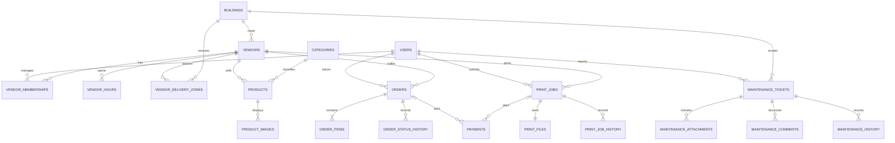

# LevGo ERD

```mermaid
erDiagram
  USERS ||--o{ VENDOR_MEMBERSHIPS : manages
  VENDORS ||--o{ VENDOR_MEMBERSHIPS : has
  BUILDINGS ||--o{ VENDORS : hosts
  VENDORS ||--o{ VENDOR_HOURS : opens
  VENDORS ||--o{ VENDOR_DELIVERY_ZONES : delivers
  BUILDINGS ||--o{ VENDOR_DELIVERY_ZONES : receives
  VENDORS ||--o{ PRODUCTS : sells
  CATEGORIES ||--o{ PRODUCTS : classifies
  PRODUCTS ||--o{ PRODUCT_IMAGES : displays
  USERS ||--o{ ORDERS : places
  VENDORS ||--o{ ORDERS : fulfills
  ORDERS ||--|{ ORDER_ITEMS : contains
  ORDERS ||--o{ ORDER_STATUS_HISTORY : records
  USERS ||--o{ PRINT_JOBS : submits
  VENDORS ||--o{ PRINT_JOBS : prints
  PRINT_JOBS ||--|| PRINT_FILES : owns
  PRINT_JOBS ||--o{ PRINT_JOB_HISTORY : records
  USERS ||--o{ MAINTENANCE_TICKETS : reports
  BUILDINGS ||--o{ MAINTENANCE_TICKETS : locates
  MAINTENANCE_TICKETS ||--o{ MAINTENANCE_ATTACHMENTS : includes
  MAINTENANCE_TICKETS ||--o{ MAINTENANCE_COMMENTS : discusses
  MAINTENANCE_TICKETS ||--o{ MAINTENANCE_HISTORY : records
  ORDERS o|--o{ PAYMENTS : pays
  PRINT_JOBS o|--o{ PAYMENTS : pays
```

